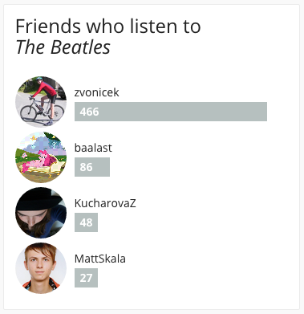

# Friends Who Listen
You probably noticed the new [Last.fm](http://last.fm) design.
One thing I really miss, the *Friends who listen to XY* widget.

So I wrote a browser extension for that.

It uses the official Last.fm API. It's pretty fast, it usually loads until a second. But to save requests, friends are cached for seven days and the concrete play counts for 24 hours.

## Installation

### Chrome
Download the latest version from [releases](https://github.com/xxdavid/lastfm-friends-who-listen/releases), open extensions and drag&drop it there.

### Firefox
This is pretty similar to Chrome, just drop it anywhere on the window.
